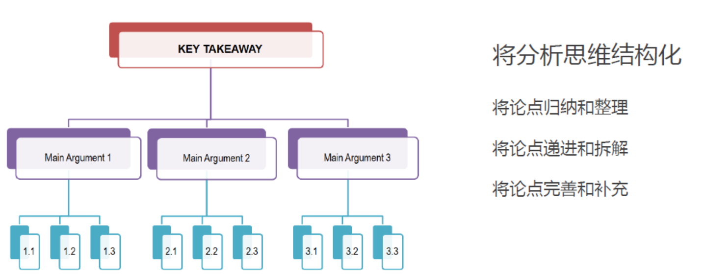
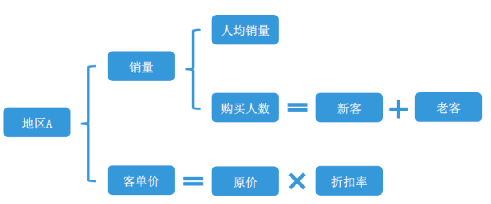
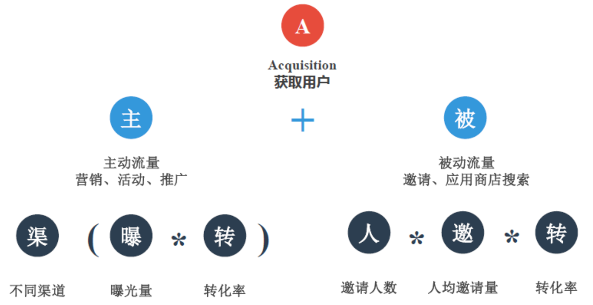

数据分析-思维方式

### 数据分析思维

-   what：三种核心思维
-   why：思维技巧
-   how：如何在业务中锻炼分析能力

### 三种核心思维

-   结构化

    -   概述：由中心论点引出分论点，再由分论点继续引出分论点，不断细化论点。

    -   举例：

        

    -   注意：思维分析，切忌想到一点分析一点，会造成思维混乱。

-   公式化

    -   概述：把论点组织为公式形式，明确论点的所需信息，且上下论点互为计算。

    -   举例：

        

        

-   业务化

    -   概述：根据实际业务情况来进行论点的分析。

    -   举例：

        论点：上海地区投放共享单车的数量？

        分析：需要根据业务情况进行分析，如上海地区哪些地方是属于人口密集地区，有哪些地铁站等等，根据实际业务来进行论点分析，然后得出结论。

-   总结：
    -   结构化思维：将思路捋顺
    -   公式化化数据：将其论点数据化、公式化
    -   业务化：落地、贴合业务

