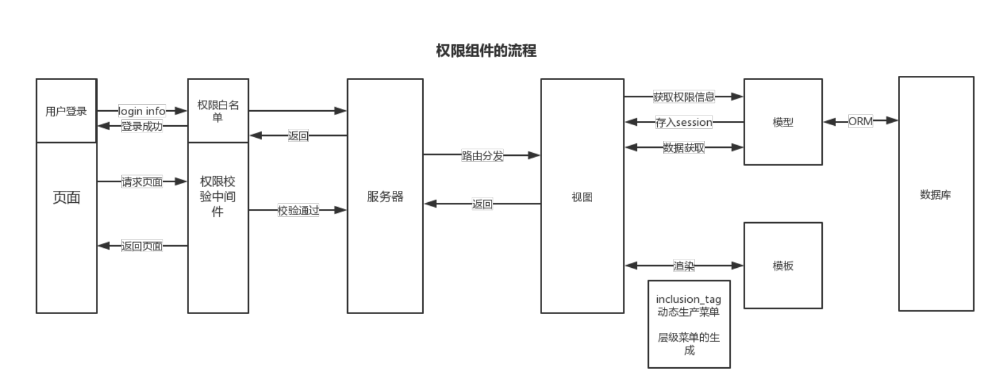
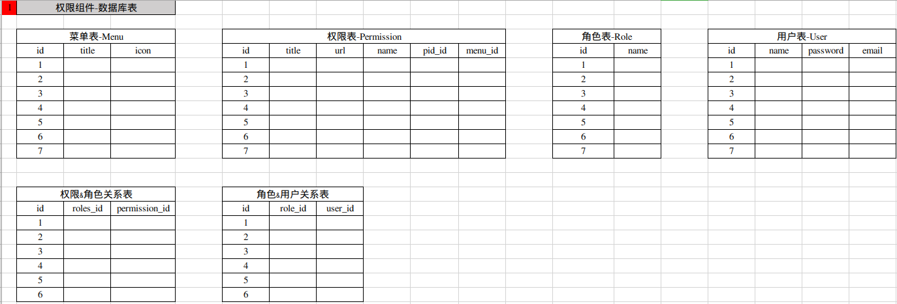

# Role-Based Access Control (基于角色的权限控制)

### RBAC流程



### 数据库表的设计



	1.菜单&权限: 一对多关系

	2.权限&角色: 多对多关系

	3.角色&用户: 多对多关系

### 登录

- 获取权限信息,并存入session

a. 获取权限信息

```python
# 根据用户角色获取所有权限
permission_list = user.roles.filter(permissions__id__isnull=False).values(
  																	  'permissions__id',
	                                                                'permissions__title',
	                                                                'permissions__url',
	                                                                'permissions__name',
	                                                                'permissions__pid_id',
	                                                                'permissions__pid__url',
	                                                                'permissions__pid__name',
	                                                                'permissions__menu_id',
	                                                                'permissions__menu__title',
	                                                                'permissions__menu__icon',
	                                                                ).distinct()
# sql
SELECT * FROM crm_userinfo as us
join crm_userinfo_roles as cur on cur.userinfo_id=us.id 
join rbac_role as rr on cur.role_id=rr.id
join rbac_role_permissions as rrp on rrp.role_id=rr.id
join rbac_permission as rp on rp.id=rrp.permission_id
where us.id=1;
# permissions__id__isnull = False : 多对多关系, 在查找权限时会, 找到很多权限为空的数据
# distinct() :  去重, 不同角色可能存在同样的权限信息
```
  
b.构建存储权限的数据结构
  ```./权限数据结构.md```

c. 存入session
```python
# 将权限信息和菜单信息 放入session, 在settings配置了存入session的key偏于修改配置
request.session[settings.MENU_SESSION_KEY] = menu_dict
request.session[settings.PERMISSION_SESSION_KEY] = permission_dict
```
  
### 中间件校验

- 校验用户是否具有权限

```python
# 白名单url 直接通过 PERMISSION_VALID_URL: 可配置白名单地址
for reg in settings.PERMISSION_VALID_URL:
	if re.match(reg, request.path_info):
		return None
# 2. 获取权限
permission_dict = request.session.get(settings.PERMISSION_SESSION_KEY)
if not permission_dict:
    return HttpResponse('无权限信息，请重新登录')
    
# 3. 对用户请求的url进行匹配
flag = False
for name, item in permission_dict.items():
	url = item['url']
	regex = "^%s$" % (url,)
	if re.match(regex, request.path_info):
		flag = True
		pid = item['pid']
		pid_name = item['pid_name']
		pid_url = item['pid_url']
		if pid:
			request.current_permission_pid = item['pid']
			request.current_breadcrumb_list.extend([
			{'title': permission_dict[pid_name]['title'], 'url': pid_url},
			{'title': item['title'], 'url': url, 'class': 'active'}
			])
		else:
			request.current_permission_pid = item['id']
			request.current_breadcrumb_list.append(
			{'title': item['title'], 'url': url, 'class': 'active'}
			)
		break
```

- 构建层级菜单数据结构

```python
# 构建的层级菜单数据列表
request.current_breadcrumb_list = [
	{'title': '首页', 'url': '#'}
]
# 通过判断当前请求的url匹配成功, 查看是否为父级权限进行层级菜单的构造
```
  
###  动态菜单的生成

- 动态菜单
```python
# 通过 创建 inclusion_tag来生成动态菜单
register = Library()

# 数据在此menu.html中渲染, 并通过模板语言使用
@register.inclusion_tag('rbac/menu.html')   
def menu(request):
"""生成动态菜单"""
menu_dict = request.session.get(settings.MENU_SESSION_KEY)

key_list = sorted(menu_dict)  # 先排序, 在存入有序字典: 使得菜单显示每次有序
ordered_dict = OrderedDict()  # 有序字典
for key in key_list:
val = menu_dict[key]
val['class'] = 'hide'
for per in val['children']:
if per['id'] == request.current_permission_pid:
    per['class'] = 'active'
    val['class'] = ''
ordered_dict[key] = val
return {
'menu_dict': ordered_dict 
}
```
- 层级菜单
```
# 通过模板语言使用
@register.inclusion_tag('rbac/breadcrumb.html')
def breadcrumb(request):
	"""生成路径导航"""
	return {
	'breadcrumb_list': request.current_breadcrumb_list
	}
```

### 批量生成权限

- 获取系统中所有url
```Python
from django.conf import settings
from django.utils.module_loading import import_string
from django.urls import URLResolver   # Django 2.0+ 使用
from collections import OrderedDict


def recursion_urls(pre_namespace, pre_url, urlpatterns, url_ordered_dict):
    """
        递归获取路由系统中的所有url
    :param pre_namespace:  前缀命名空间
    :param pre_url: 前缀
    :param urlpatterns: 
    :param url_ordered_dict:
    :return:
    """
    for item in urlpatterns:
        # 判断是否是路由分发类,即项目下的urls.py
        if isinstance(item, URLResolver):

            if pre_namespace:
                if item.namespace:
                    namespace = "%s:%s" % (pre_namespace, item.namespace,)
                else:
                    namespace = pre_namespace
            else:

                if item.namespace:
                    namespace = item.namespace

                else:
                    namespace = None

            # 问题: 主url中采用path()方法来做路由分发时, 所有通过item.pattern.regex.pattern获取的路由分发前缀后面会加上"\/",导致最后生产的url出现"\",
            # 例如:/stark\/crm/department/list/
            # 此问题出现 是项目主ulr下采用的是path()来做路由分发出现, 如果采用url来不会出现上述问题
            # if r"\/" in patt:
            #     patt = patt.replace(r"\/", "/")  # 通过
            #     # patt = patt.split(r'\/')[0] + "/"  # 通过
            # print(patt)
            
            patt = item.pattern.regex.pattern
            recursion_urls(namespace, pre_url + patt, item.url_patterns, url_ordered_dict)
        else:
            # 根路由, 应用下的urls.py
            if pre_namespace:
                name = "%s:%s" % (pre_namespace, item.name,)
            else:
                name = item.name

            if not item.name:
                raise Exception('URL路由中必须设置name属性')

            patt = item.pattern.regex.pattern

            url = pre_url + patt

            url_ordered_dict[name] = {'name': name, 'url': url.replace('^', '').replace('$', '')}


def get_all_url_dict(ignore_namespace_list=None):
    """
    获取路由中
    :return:
    """
    ignore_list = ignore_namespace_list or []
    url_ordered_dict = OrderedDict()

    md = import_string(settings.ROOT_URLCONF)
    # print(md.urlpatterns)
    urlpatterns = []

    for item in md.urlpatterns:

        if item.namespace in ignore_list:
            continue
        urlpatterns.append(item)

    recursion_urls(None, "/", urlpatterns, url_ordered_dict)

    return url_ordered_dict
```
- 获取数据库中所有权限与系统url做相关操作
```python
def multi_permissions(request):
    """
    批量操作权限
    :param request:
    :return:
    """
    post_type = request.GET.get('type')
    # 这里采用forset_factory批量生成表单对象
    MultiPermissionFormSet = formset_factory(MultiPermissionForm, extra=0)
    generate_formset = None
    update_formset = None

    if request.method == 'POST' and post_type == 'generate':
        formset = MultiPermissionFormSet(request.POST)
        if not formset.is_valid():
            generate_formset = formset  # 直接赋值给generate_formset, 不用在后面重新计算待新建权限
        else:
            for row_dict in formset.cleaned_data:
                row_dict.pop('id')
                models.Permission.objects.create(**row_dict)

    if request.method == 'POST' and post_type == 'update':
        formset = MultiPermissionFormSet(request.POST)
        if formset.is_valid():
            for row_dict in formset.cleaned_data:
                permission_id = row_dict.pop('id')
                models.Permission.objects.filter(id=permission_id).update(**row_dict)
        else:
            update_formset = formset  # update_formset, 不用在后面重新计算待更新权限

    # 1.1 去数据库中获取所有权限
    # [{},{}]
    permissions = models.Permission.objects.all().values('id', 'title', 'url', 'name', 'menu_id', 'pid_id')
    # {'rbac:menu_list':{},'rbac:menu_add':{..}}
    permisssion_dict = OrderedDict()
    for per in permissions:
        permisssion_dict[per['name']] = per

    # 1.2 数据库中有的所有权限name的集合
    permission_name_set = set(permisssion_dict.keys())

    # 2.1 获取路由系统中所有的URL
    # {'rbac:menu_list':{'url':.... },,,}
    router_dict = get_all_url_dict(ignore_namespace_list=['admin'])

    # 把数据库中权限信息 更新到 router_dict中,即 数据库中和从系统url获取的url数据一样.
    for row in permissions:
        name = row['name']
        if name in router_dict:
            router_dict[name].update(row)

    print("---------", router_dict)
    # 2.2 路由系统中的所有权限name的集合
    router_name_set = set(router_dict.keys())

    # 需要新建：数据库无、路由有
    if not generate_formset:
        generate_name_list = router_name_set - permission_name_set
        generate_formset = MultiPermissionFormSet(
            initial=[row for name, row in router_dict.items() if name in generate_name_list])

    # 需要删除：数据库有、路由无
    destroy_name_list = permission_name_set - router_name_set
    destroy_formset = MultiPermissionFormSet(
        initial=[row for name, row in permisssion_dict.items() if name in destroy_name_list])

    # 需要更新：数据库有、路由有
    if not update_formset:
        update_name_list = permission_name_set.intersection(router_name_set)
        update_formset = MultiPermissionFormSet(
            initial=[row for name, row in router_dict.items() if name in update_name_list])

    return render(
        request,
        'rbac/multi_permissions.html',
        {
            'destroy_formset': destroy_formset,
            'update_formset': update_formset,
            'generate_formset': generate_formset,
        }
    )

```


